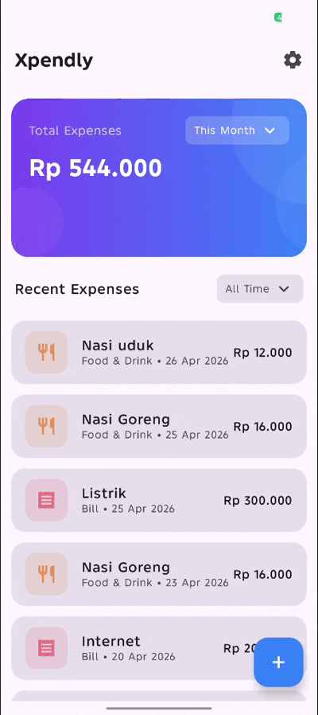
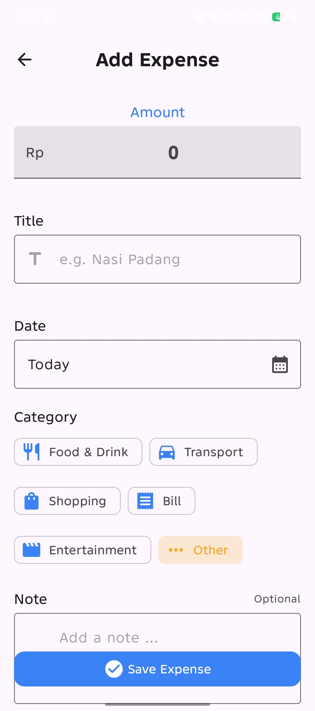
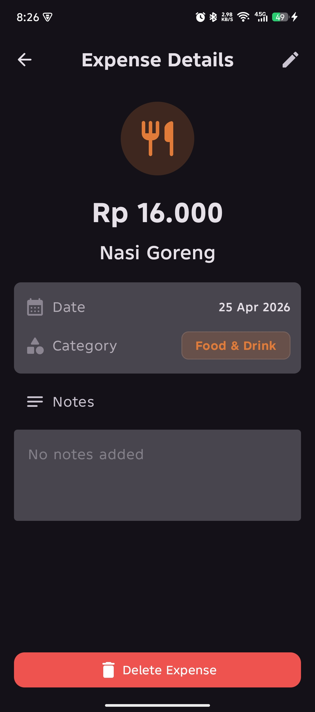
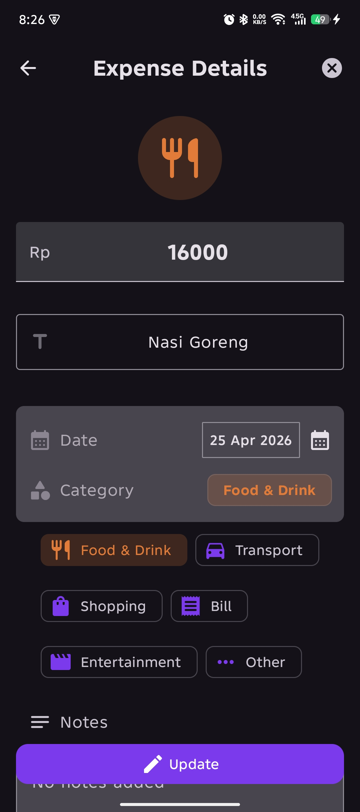
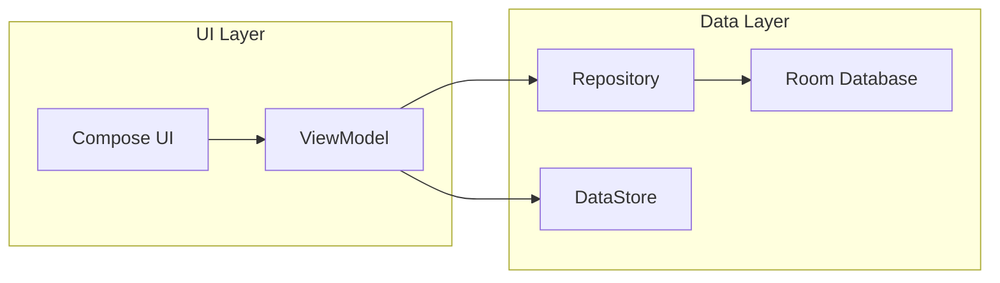

# Xpendly

Android expense tracker application built with Kotlin and Jetpack Compose using MVVM architecture
and reactive state management

---

## 🚀 Features

Core (MVP):

- Add, view, update and delete expenses
- Filter by day, week, month, year, or all time
- Total expense summary per filter
- Theme setting (Light, Dark, Auto)

---

## 📱 Preview

### Demo

### Screenshots

| Home Screen| Add Expense| Detail Screen| Update Expense|
|:------------:|:------------:|:--------------:|:---------------:|
|  |  |  |  |

---

## 🛠️ Tech Stack

- **Language** : Kotlin
- **UI** : Jetpack Compose + Material 3
- **Architecture** : MVVM + Clean Architecture (no domain layer)
- **DI** : Hilt
- **Database** : Room
- **Preferences** : DataStore

---

## 🏗️ Architecture

This project uses MVVM to separate UI, business logic, and data layer for better scalability, and
follows Clean Architecture principles without a domain layer, repositories are injected directly
into ViewModels for simplicity

UI Layer:

- Jetpack Compose screens
- State collection from ViewModel
- Stateless composables
- State management using StateFlow

Data Layer:

- Repository pattern
- Room database
- DataStore preferences

---

## 🧠 Technical Highlights

- Implemented reactive filtering using StateFlow
- Used repository pattern for clean data abstraction
- Applied dependency injection with Hilt
- Structured Compose UI into reusable components

---

## ⚡ Technical Challenges

Challenges faced during development:

- Managing recomposition when filters change
- Maintaining single source of truth
- Designing reusable Compose components
- Handling date filtering efficiently

---

## 🔥 Future Improvements (planned)

- Search functionality
- Expense analytics charts
- Budget limit alerts
- Cloud backup